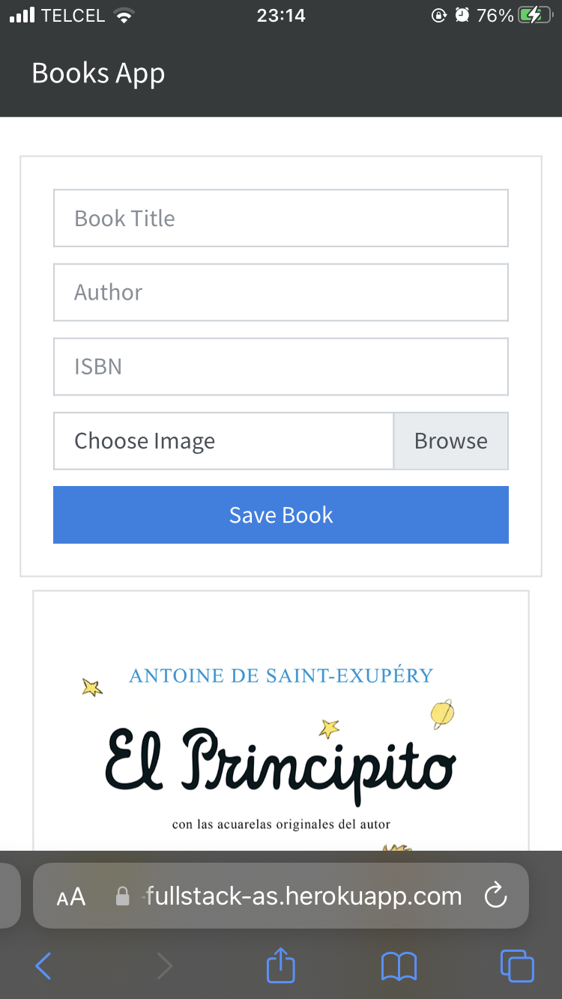
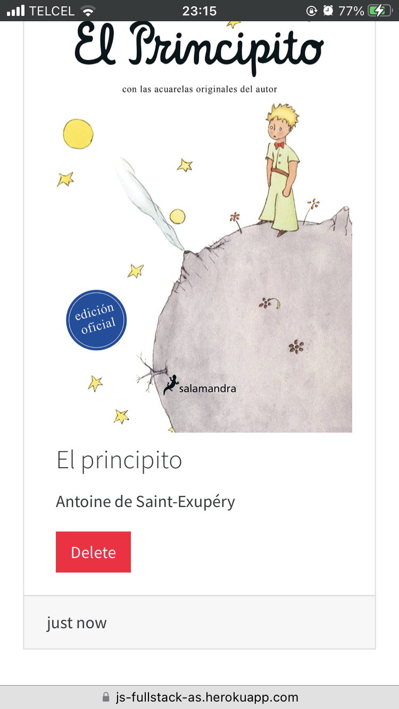

# JavaScript Full Stack
## [Web App](https://js-fullstack-as.herokuapp.com)
___
Web application developed with:
- bootstrap for the frontend
- webpack as bundler
- express for the backend
- mongodb as database
- heroku for deploy
- mongo atlas as a database service
___

